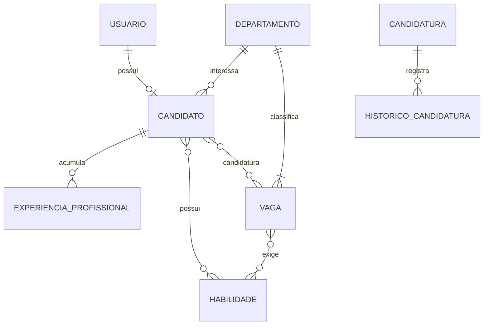

# Diagrama Entidade-Relacionamento (DER) — TalentBase

> Traduz o modelo de domínio já implementado no front-end (`src/types/`, `ARQUITETURA-TALENTBASE.md`) para um modelo relacional normalizado, pronto para virar banco MySQL. O diagrama visual está em `TalentBase-DER-Apresentacao.pptx`; este documento é a referência textual completa (todas as tabelas, colunas, chaves e justificativas).

---

## 1. Do modelo do front-end ao modelo relacional

O front-end trabalha com objetos como `Candidate.skills: string[]` e `Job.skills: string[]` — arrays de texto livre. Isso é aceitável em memória, mas viola a 1ª Forma Normal em um banco relacional (uma coluna não deve guardar uma lista). A mesma coisa acontece com `Job.department: string` (texto livre repetido em cada vaga) e `Job.candidatesCount` (um contador guardado que pode ficar dessincronizado do valor real).

Este DER resolve os três problemas:
- `skills[]` → entidade **Habilidade** + duas tabelas associativas (`candidato_habilidade`, `vaga_habilidade`)
- `department: string` → entidade **Departamento**, referenciada por chave estrangeira
- `candidatesCount` → **removido do modelo** — é um valor derivado (`COUNT(*)` sobre `candidatura`), não uma coluna armazenada

---

## 2. Entidades e atributos

### 2.1 `usuario`
Credenciais de acesso — tanto de quem trabalha no RH quanto de candidatos que criaram conta no portal.

| Coluna | Tipo | Restrições |
|---|---|---|
| **id_usuario** | INT | **PK**, AUTO_INCREMENT |
| nome | VARCHAR(150) | NOT NULL |
| email | VARCHAR(150) | NOT NULL, UNIQUE |
| senha_hash | VARCHAR(255) | NOT NULL |
| tipo_usuario | ENUM('RH','CANDIDATO') | NOT NULL |
| data_cadastro | DATETIME | NOT NULL, DEFAULT CURRENT_TIMESTAMP |

### 2.2 `candidato`
Ficha do candidato — pode existir **sem** login (cadastro manual pelo RH) ou vinculada a um `usuario` (quando o próprio candidato se cadastra no portal).

| Coluna | Tipo | Restrições |
|---|---|---|
| **id_candidato** | INT | **PK**, AUTO_INCREMENT |
| id_usuario | INT | **FK** → `usuario.id_usuario`, UNIQUE, NULL |
| nome | VARCHAR(150) | NOT NULL |
| email | VARCHAR(150) | NOT NULL, UNIQUE |
| telefone | VARCHAR(20) | NULL |
| cidade | VARCHAR(100) | NULL |
| estado | CHAR(2) | NULL |
| cargo_pretendido | VARCHAR(150) | NULL |
| id_departamento_interesse | INT | **FK** → `departamento.id_departamento`, NULL |
| curriculo_url | VARCHAR(255) | NULL |
| data_cadastro | DATETIME | NOT NULL, DEFAULT CURRENT_TIMESTAMP |

### 2.3 `departamento`
Tabela de apoio — substitui a lista fixa (`DEPARTMENTS`) que hoje vive no front-end.

| Coluna | Tipo | Restrições |
|---|---|---|
| **id_departamento** | INT | **PK**, AUTO_INCREMENT |
| nome | VARCHAR(100) | NOT NULL, UNIQUE |

### 2.4 `habilidade`
Tabela de apoio — normaliza os arrays `skills[]` de `Candidate` e `Job`.

| Coluna | Tipo | Restrições |
|---|---|---|
| **id_habilidade** | INT | **PK**, AUTO_INCREMENT |
| nome | VARCHAR(100) | NOT NULL, UNIQUE |

### 2.5 `vaga`

| Coluna | Tipo | Restrições |
|---|---|---|
| **id_vaga** | INT | **PK**, AUTO_INCREMENT |
| titulo | VARCHAR(150) | NOT NULL |
| id_departamento | INT | **FK** → `departamento.id_departamento`, NOT NULL |
| localizacao | VARCHAR(150) | NULL |
| modalidade | ENUM('Presencial','Híbrido','Remoto') | NOT NULL |
| tipo_contrato | ENUM('CLT','PJ','Estágio','Freelance') | NOT NULL |
| numero_vagas | INT | NOT NULL, DEFAULT 1 |
| status | ENUM('Aberta','Em Processo','Encerrada') | NOT NULL, DEFAULT 'Aberta' |
| data_publicacao | DATE | NOT NULL, DEFAULT (CURRENT_DATE) |
| experiencia_minima_meses | INT | NOT NULL, DEFAULT 0 |
| descricao | TEXT | NULL |

*(`candidatesCount` não existe aqui — ver seção 5.2)*

### 2.6 `candidatura`
**Entidade associativa** que resolve o relacionamento N:M entre `candidato` e `vaga` — e carrega atributos próprios (não é uma tabela de ligação "pura").

| Coluna | Tipo | Restrições |
|---|---|---|
| **id_candidatura** | INT | **PK**, AUTO_INCREMENT |
| id_candidato | INT | **FK** → `candidato.id_candidato`, NOT NULL |
| id_vaga | INT | **FK** → `vaga.id_vaga`, NOT NULL |
| status | ENUM('Novo','Em Análise','Entrevista','Aprovado','Reprovado') | NOT NULL, DEFAULT 'Novo' |
| data_candidatura | DATE | NOT NULL, DEFAULT (CURRENT_DATE) |
| observacoes | TEXT | NULL |
| | | **UNIQUE** (id_candidato, id_vaga) — impede candidatura duplicada |

### 2.7 `historico_candidatura`
Timeline de mudanças de status de uma candidatura (exibida em `/candidato/candidaturas`).

| Coluna | Tipo | Restrições |
|---|---|---|
| **id_historico** | INT | **PK**, AUTO_INCREMENT |
| id_candidatura | INT | **FK** → `candidatura.id_candidatura`, NOT NULL |
| status | ENUM('Novo','Em Análise','Entrevista','Aprovado','Reprovado') | NOT NULL |
| data_mudanca | DATETIME | NOT NULL, DEFAULT CURRENT_TIMESTAMP |
| alterado_por | VARCHAR(150) | NOT NULL (ex.: "Sistema", "RH - Ana") |

### 2.8 `experiencia_profissional`

| Coluna | Tipo | Restrições |
|---|---|---|
| **id_experiencia** | INT | **PK**, AUTO_INCREMENT |
| id_candidato | INT | **FK** → `candidato.id_candidato`, NOT NULL |
| empresa | VARCHAR(150) | NOT NULL |
| cargo | VARCHAR(150) | NOT NULL |
| data_inicio | DATE | NOT NULL |
| data_fim | DATE | NULL (NULL = emprego atual) |
| descricao | TEXT | NULL |

### 2.9 `candidato_habilidade` (tabela associativa — M:N)

| Coluna | Tipo | Restrições |
|---|---|---|
| id_candidato | INT | **FK** → `candidato.id_candidato` |
| id_habilidade | INT | **FK** → `habilidade.id_habilidade` |
| | | **PK composta** (id_candidato, id_habilidade) |

### 2.10 `vaga_habilidade` (tabela associativa — M:N)

| Coluna | Tipo | Restrições |
|---|---|---|
| id_vaga | INT | **FK** → `vaga.id_vaga` |
| id_habilidade | INT | **FK** → `habilidade.id_habilidade` |
| | | **PK composta** (id_vaga, id_habilidade) |

---

## 3. Relacionamentos e cardinalidade

| Relacionamento | Cardinalidade | Leitura |
|---|---|---|
| `usuario` — `candidato` | **(0,1) : (0,1)** | Um usuário do tipo Candidato tem no máximo um perfil de candidato; um perfil de candidato pode não ter usuário ainda (cadastro manual pelo RH) |
| `departamento` — `candidato` | **1 : N** (opcional do lado candidato) | Um departamento pode ser o interesse de Muitos candidatos; um candidato tem interesse em, no máximo, Um departamento |
| `departamento` — `vaga` | **1 : N** | Um departamento pode ter Muitas vagas; uma vaga pertence a exatamente Um departamento |
| `candidato` — `experiencia_profissional` | **1 : N** | Um candidato pode ter Muitas experiências profissionais; uma experiência pertence a Um candidato |
| `candidato` — `habilidade` | **N : M** (via `candidato_habilidade`) | Um candidato pode ter Muitas habilidades; uma habilidade pode pertencer a Muitos candidatos |
| `vaga` — `habilidade` | **N : M** (via `vaga_habilidade`) | Uma vaga pode exigir Muitas habilidades; uma habilidade pode ser exigida por Muitas vagas |
| `candidato` — `vaga` | **N : M** (via `candidatura`) | Um candidato pode se candidatar a Muitas vagas; uma vaga pode receber Candidaturas de Muitos candidatos |
| `candidatura` — `historico_candidatura` | **1 : N** | Uma candidatura tem Muitas entradas de histórico; uma entrada de histórico pertence a Uma candidatura |

---

## 4. Diagrama (texto/Mermaid)

Referência rápida em notação Mermaid (pode ser colado em draw.io via *Extras → Edit Diagram* ou em [mermaid.live](https://mermaid.live) para gerar uma imagem, caso queiram um formato alternativo ao PowerPoint):

---

## 5. Decisões de modelagem e normalização

### 5.1 Resolvendo os três relacionamentos N:M
1. **Candidato ↔ Vaga** → entidade associativa **`candidatura`**. Diferente de uma tabela de ligação pura, ela carrega atributos próprios (`status`, `data_candidatura`, `observacoes`) — porque o status "Em Análise", por exemplo, não é um atributo do candidato nem da vaga isoladamente, é um atributo **da relação entre os dois**.
2. **Candidato ↔ Habilidade** → tabela associativa pura **`candidato_habilidade`** (só as duas chaves estrangeiras).
3. **Vaga ↔ Habilidade** → tabela associativa pura **`vaga_habilidade`** (mesma lógica).

### 5.2 O maior desafio: `status` pertence ao candidato ou à candidatura?
No front-end mockado (herdado da primeira versão), `Candidate.status` era um campo solto no próprio registro do candidato — como se um candidato só pudesse estar em um processo seletivo por vez. Isso não se sustenta: um candidato pode (e deve poder) se candidatar a várias vagas ao mesmo tempo, cada uma em uma etapa diferente do processo.

**Solução:** o status deixou de ser um atributo de `candidato` e passou a ser um atributo de `candidatura` — a entidade associativa entre candidato e vaga. Isso também resolveu, de quebra, o histórico: `historico_candidatura` é uma tabela filha de `candidatura` (não de `candidato`), então cada candidatura tem sua própria timeline independente.

### 5.3 `candidatesCount` não virou coluna
O front-end mockado guardava `Job.candidatesCount` como um número solto, incrementado manualmente a cada nova candidatura. Isso é uma violação clássica de 3ª Forma Normal (um valor que pode ser **calculado** a partir de outra tabela não deveria ser **armazenado** — o risco é a coluna ficar dessincronizada da realidade, por exemplo se uma candidatura for excluída e ninguém lembrar de decrementar o contador). No modelo relacional, isso passa a ser sempre `SELECT COUNT(*) FROM candidatura WHERE id_vaga = ?` — nunca precisa de sincronização manual.

### 5.4 Skills como texto livre → entidade própria
`skills: string[]` em `Candidate` e `Job` violava a 1ª Forma Normal (coluna guardando lista). Criamos a entidade `habilidade` como tabela de apoio (evita duplicar a string "React" uma vez por candidato e outra vez por vaga) e duas tabelas associativas. Isso também abre a porta para o **ranking de candidatos por vaga** comparar habilidades de forma estruturada (`JOIN` entre as duas tabelas associativas), em vez de comparar arrays de texto em memória como o front-end faz hoje.

### 5.5 `usuario` e `candidato` como entidades separadas
Poderíamos ter colocado `email`/`senha_hash` direto na tabela `candidato`. Não fizemos isso por dois motivos: (1) o RH também precisa de login, e não faz sentido um "candidato" ter uma linha só para representar um funcionário do RH; (2) o RH pode cadastrar um candidato manualmente (`RegisterCandidatePage`) **antes** de esse candidato ter qualquer conta — nesse momento, existe `candidato` sem `usuario` correspondente. Separar as duas entidades com um relacionamento opcional (0,1):(0,1) modela essa realidade sem gambiarra.

### 5.6 `alterado_por` como texto, não chave estrangeira
Em `historico_candidatura`, o campo `alterado_por` guarda um texto simples ("Sistema", "RH - Ana") em vez de uma FK para `usuario`. Isso é uma simplificação consciente para o MVP: nem toda mudança de status é feita por um usuário logado (a primeira entrada do histórico, por exemplo, é sempre gerada pelo "Sistema" no momento da candidatura). Documentamos aqui como possível evolução futura: transformar em `id_usuario INT NULL FK` + um valor padrão de texto para os casos automáticos.
